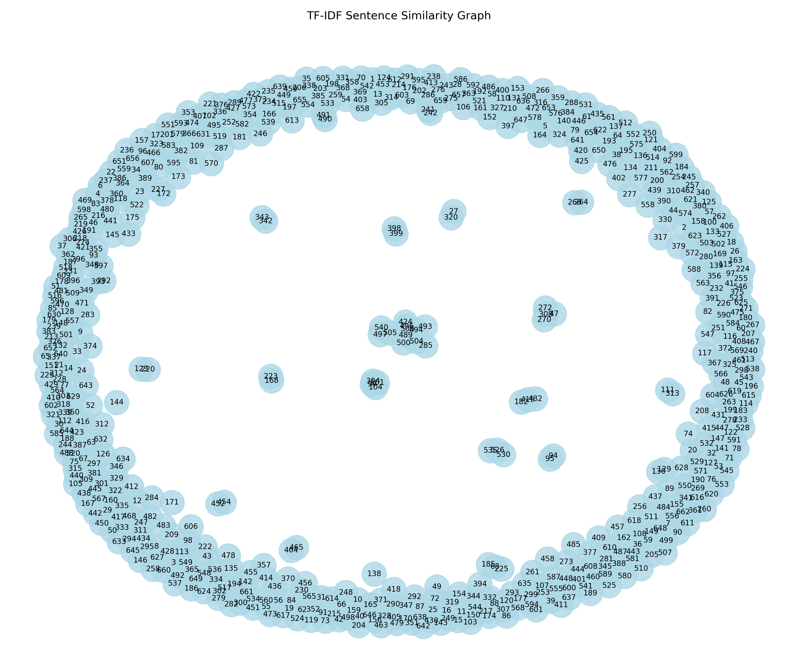
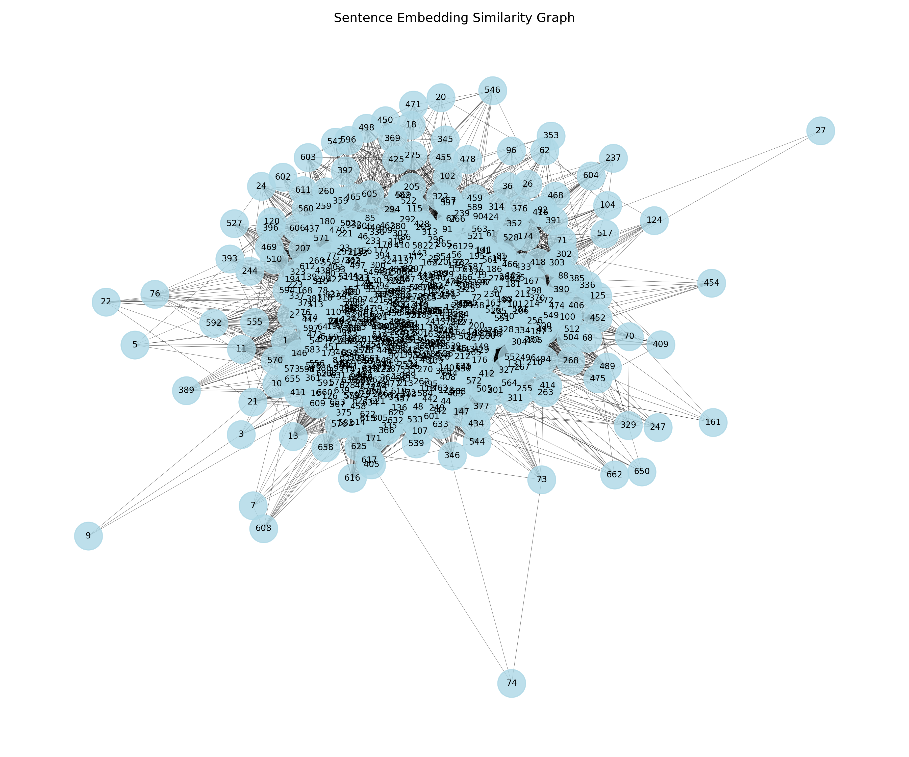

# Programmieraufgaben - Seminar zu Generativer KI

Konrad Christoph Martens; Finnian Kühn

## 01 - BPE-Tokenizer

### a)

Vor Beginn der Implementierung des BPE-Tokenizers wurden weitere [Informationen](https://huggingface.co/learn/llm-course/chapter6/5) über den Algorithmus und dessen Implementierung gesammelt, die als Grundlage für die Implementierung dienten.

1. Das Ausgangsvokabular wird mit einzelnen Zeichen und speziellen Tokens initialisiert. Der Textkorpus wird in Wörter zerlegt, die weiter in Listen bestehend aus ihren einzelnen Zeichen unterteilt werden. Auf diese Weise werden die Ausgangs-Tokens erzeugt.
2. In einem iterativen Prozess wird über alle Wortvorkommen das häufigste benachbarte Token-Paar ermittelt.
3. Dieses häufigste Paar wird zu einem neuen Token gemerged, dem Vokabular hinzugefügt und ersetzt das Paar in allen bestehenden Tokensequenzen aller Wörter. Jedes neue Token erhält eine eindeutige Token-ID.
4. Die Schritte 2 und 3 werden wiederholt, bis die festgelegte Vokabulargröße erreicht ist.
5. Schließlich wird aus dem endgültigen, nach größe sortierten Vokabular ein Regex-Muster erzeugt, das zur effizienten Tokenisierung neuer Texte verwendet wird, wobei die Token-IDs zum Matching verwendet werden.

Um den Tokenizer ausführen und trainieren zu können, sind folgende Schritte notwendig:
1. In der [Konfigurationsdatei](bpe_tokenizer/config.py) gewünschte Vokabulargröße setzen.
2. [train_tokenizer.py](bpe_tokenizer/train_tokenizer.py) ausführen, um den Tokenizer auf den bereitgestellten Textsammlungen zu trainieren.
3. Für die Tokenisierung der Textsätze [analyse_tokenizer.py](bpe_tokenizer/analyse_tokenizer.py) ausführen.

### b)

Für den Vergleich wurden drei Tokenizer (Deutsch, Englisch, Deutsch + Englisch) auf dem verlinkten Datensatz des Auswärtigen Amtes trainiert. Dabei wurden drei Versionen mit unterschiedlichen Wortschatzgrößen (500, 1000, 1500) trainiert.

Im Rahmen der Analyse wurden alle Versionen des Tokenizers mit jeweils drei deutschen, englischen und gemischten Sätzen getestet, die jeweils die gleiche Aussage enthalten und in der [Konfigurationsdatei](bpe_tokenizer/config.py) definiert sind. Für die Diagramme wurde die durchschnittliche Anzahl der Tokens pro Satz berechnet und auf der y-Achse aufgetragen. Alle drei Tokenizer werden pro Vokabulargröße für alle drei Sprachen verglichen.

**Vokabulargröße: 500**

**Vokabulargröße: 1000**

**Vokabulargröße: 1500**

**Ergebnisse**

Generell lässt sich aus den Diagrammen erkennen, dass die durchschnittliche Anzahl der Tokens pro Satz mit zunehmender Vokabelgröße abnimmt. Außerdem erzielen die auf Deutsch bzw. Englisch trainierten Tokenizer bessere Ergebnisse für Sätze in der jeweiligen Sprache. Die Anzahl der Token für gemischte Sätze liegt für beide Tokenizer zwischen den Ergebnissen für deutsche und englische Sätze.
Der kombinierte Tokenizer erzielt auch die besten Ergebnisse für Sätze in der gemischten Sprache, für die er trainiert wurde. Bei höheren Vokabelgrößen erzielt er teilweise bessere Ergebnisse als die einsprachigen Tokenizer.

Dabei ist die reine Anzahl der Tokens bei allgemeinsprachlichen Sätzen über alle Vokabelgrößen hinweg geringer als bei Sätzen, die Fachtermini o.ä. enthalten. Dieses Phänomen hängt vermutlich stark von dem Text ab, mit dem der Tokenizer trainiert wurde. Hier wurde, wie bereits erwähnt, ein Text des Auswärtigen Amtes verwendet, der vermutlich nur wenige Begriffe aus dem Bereich der Programmierung enthält. Außerdem ist der Umfang des Korpus eher gering, was die Fokussierung auf die Domäne verstärkt.

### c)

Die Anzahl der Token pro Satz hängt direkt von der Größe des Vokabulars ab. Kleine Vokabulare (z.B. 500) erzeugen mehr und kürzere Tokens, große Vokabulare (z.B. 1500) weniger und längere Tokens, die ganze Wörter oder sinnvolle Wortteile umfassen können. Dabei gilt: Kleine Vokabulare ermöglichen ein schnelleres Training bei ineffizienter Kodierung, große Vokabulare verlangsamen das Training, bieten aber eine effizientere Kodierung. Dies erklärt die abnehmende Anzahl von Tokens pro Satz mit zunehmender Vokabulargröße. Die größten Effizienzgewinne werden bei Vokabelgrößen zwischen 500 und 1000 erzielt.

Das Phänomen, dass Tokenizer in der trainierten Sprache am besten funktionieren, lässt sich durch sprachspezifische Eigenschaften erklären, die während des Trainings erlernt werden. So hat der deutsche Tokenizer gelernt, deutsche Komposita und Wortendungen wie "en", "ung" etc. effizient zu kodieren, während der englische Tokenizer englische Wortbestandteile wie "ing", "ly" besser repräsentiert. Beide zeigen deutliche Schwächen bei fremdsprachigen Texten, da sie dort häufig vorkommende Tokens nicht gelernt haben. Gemischte Sätze liegen in der Anzahl der Tokens zwischen den Werten einsprachiger Sätze, da jeweils ein Teil des Satzes effizient kodiert werden kann.

Der kombinierte mehrsprachige Tokenizer erweist sich bei gemischten Sätzen als vorteilhaft, da er beide Sprachmuster abdeckt. Bei größeren Wortschätzen führt dies sogar dazu, dass die gemischten Sätze mit dem kombinierten Tokenizer weniger Tokens benötigen als die monolingualen Sätze mit dem jeweiligen monolingualen Tokenizer. Dies kann darauf zurückgeführt werden, dass insbesondere der erste deutsche Testsatz viele Wörter enthält, die auch im Englischen so verwendet werden und der kombinierte Tokenizer diese daher sehr effizient kodieren kann.

Die Wahl des Tokenizers hängt stark vom Anwendungsszenario ab:
- Einsprachige Systeme: sprachspezifische Tokenizer mit großem Wortschatz
- Mehrsprachige/gemischte Inhalte: Kombinierte Tokenizer für konsistente Ergebnisse über Sprachgrenzen hinweg
- Ressourcenbeschränkte Szenarien (kleiner Wortschatz, wie in diesem Szenario): Mehrsprachiger Ansatz für beste Balance zwischen Kompaktheit und Flexibilität

## 02 - Wort-Taschenrechner

### a)

Um den Wortrechner umzusetzen, wurde gensim verwendet. Darüber können sehr einfach Modelle heruntergeladen werden und genutzt werden, um Embeddings zu erhalten und mit ihnen zu rechnen. Zunächst wurde ein Word2Vec Modell verwendet, was zu einem späteren Zeitpunkt durch "glove-wiki-gigaword-50" ersetzt wurde, um Aufgabenteil b) zu entsprechen ([Quelle](https://radimrehurek.com/gensim/auto_examples/howtos/run_downloader_api.html)).

1. Eingabe überprüfen und in einzelne Elemente aufteilen
2. Operator identifizieren und anhand dieses, Wörter in zwei Listen (positiv und negativ) aufteilen
3. Funktion auf Modell aufrufen und Listen übergeben -> Rückgabewert ist Liste aus Wörtern und Übereinstimmungsgrad (0-1)
4. Die 5 besten Ergebnisse ausgeben

An das Modell übergebene Wörter müssen aus Ergebnisses gefiltert werden, da diese sonst häufig die größte Übereinstimmung haben ([Quelle](https://blog.esciencecenter.nl/king-man-woman-king-9a7fd2935a85)). Bei gensim geschieht das bereits automatisch

#### Weitere Beispiele und erwartetes Ergebnis:

-   winter - cold + hot = summer
-   pizza - italy + japan = sushi
-   paris - france + germany = berlin
-   paris - france + italy = rome
-   teacher - school + court = lawyer
-   museum - art + science = labroratory (oder ähnlich)
-   uncle - man + woman = aunt
-   apple - iphone + galaxy = samsung (Hier fallen unterschiedliche Bedeutungen für das gleiche Wort stark ins Gewicht)

### b)

#### Implementierung mit BERT

Für die Umsetzung mit Transfomer-Technologie wird die Bibliothek "transformers" verwendet, über die vortrainierte Modelle und Tokenizer (in diesem Fall BERT) genutzt werden können [Quelle](https://mccormickml.com/2019/05/14/BERT-word-embeddings-tutorial/#2-input-formatting). Diese werden genutzt, um zunächst die Embeddings von 10000 englischen Wörtern aus einer Text-Datei zu berechnen, damit dies nicht bei jedem Funktionsaufruf getan werden muss. Da es sich lediglich um einzelne Wörter ohne Kontext handelt, wird das Ergebnis jedes mal das gleiche sein, weshalb dieser Schritt einmalig am Anfang ausgeführt werden kann:

1. Wörter auslesen und in Liste speichern
2. Für jedes Wort:

    1. Tokenisieren und dabei Sondertokens hinzufügen
    2. Modell mit input aufrufen
    3. [CLS-Token](https://aditya007.medium.com/understanding-the-cls-token-in-bert-a-comprehensive-guide-a62b3b94a941) zur weiteren Berechnung verwenden, da dieses die "Zusammenfassung" abbildet
    4. Ergebnis in Liste speichern

Der weitere Programmablauf ist dann wie folgt:

1. Eingabe überprüfen und in einzelne Elemente aufteilen
2. Operator identifizieren und anhand dieses, Wörter in zwei Listen (positiv und negativ) aufteilen
3. Für Elemente in positiver Liste Embeddings addieren, für negative subtrahieren
4. Das Ergebnis mit den zuvor berechneten Embeddings abgleichen (analog zu GloVe wieder ohne die Wörter, die in der Rechnung enthalten sind) und die fünf Wörter mit den ähnlichsten Embeddings ausgeben

#### Ergebnisse der Beispielrechnungen

| Rechnung                 | Ergebnis GloVe                                 | Ergebnis BERT                            |
| ------------------------ | ---------------------------------------------- | ---------------------------------------- |
| king - man + woman       | queen (Score: 0.8524)                          | lady (Score: 0.9683)                     |
| winter - cold + hot      | summer (Score: 0.8098)                         | spring (Score: 0.9501), summer Platz 2   |
| pizza - italy + japan    | sushi (Score: 0.6841)                          | trip (Score: 0.9551)                     |
| paris - france + germany | berlin (Score: 0.9204)                         | camp (Score: 0.9444)                     |
| paris - france + italy   | rome (Score: 0.8466)                           | afraid (Score: 0.9436), city auf Platz 2 |
| teacher - school + court | judge (Score: 0.8214), lawyer (Score: 0.8119)  | student (Score: 0.9549)                  |
| museum - art + science   | institute (Score: 0.8447), labroratory Platz 3 | garden (Score: 0.9005)                   |
| uncle - man + woman      | daughter (Score: 0.9003), aunt Platz 4         | lady (Score: 0.9644)                     |
| apple - iphone + galaxy  | milky (Score: 0.6767)                          | blue (Score: 0.9628)                     |

Zu erkennen ist, dass der traditionelle Ansatz (GloVe) deutlich bessere Ergebnisse erzielt und lediglich bei einer besonders kontextabhängigen Rechnung, kein passendes Ergebnis in den fünf größten Übereinstimmungen zu finden ist. Bei dem Ansatz, in welchem die Transformer-Technologie verwendet wird, gibt es nur eine Rechnung, für die ein zufriedenstellendes Ergebnis erzielt wurde.

Diese Ergebnisse sind damit zu erklären, dass GloVe speziell für diese Art von Aufgaben trainiert und entwickelt wurde. Es werden kontextunabhängig schnell und zuverlässig die immer gleichen Vektoren für Wörter zurückgegeben, mit welchen direkt gerechnet werden kann. Für andere Anwendungsfälle ist das schlecht (Sitz(bank) und Geld(bank)), dafür jedoch sehr performant.

Transformer-Modelle sind, im Gegensatz dazu, speziell dafür entwickelt worden kontextsensitiv zu funktionieren. Für einfache Rechnung, wie sie in diesem Fall vorliegen, sind solche Modelle hingegen unpräzise, weshalb inkonsistente, bzw. ungenauere Ergebnisse erzielt wurden. Des weiteren, ist die Rechenzeit deutlich länger, um Embeddings zu erhalten, weshalb für diese Implementierung eine Optimierung vorgenommen wurde.

Insgesamt sind traditionelle Technologien wie GloVe für diese Art der Berechnungen deutlich besser geeignet, während Transformer-Modelle besser funktionieren, um Embeddings im Zusammenhang mit ganzen Sätzen oder Texten, zu berechnen.

### c)

Sinnvolle Rechenoperationen im Rahmen eines solchen Rechners sind die Addition und die Subtraktion, wie sie im Rahmen dieser Aufgabe bereits ausgeführt wurden.

Eine weitere Operation ist die Multiplikation, jedoch mit Zahlen anstelle von Wörtern. Das könnte zur Steigerung, beziehungsweise Minderung führen (Bsp.: 2 \* stark = stärker)

Andere Operationen, wie Division und Potenz-/Wurzelbildung sind nicht sinnvoll, da sie keine sinnvolle Interpretation/Bedeutung zulassen.

## 03 - TextRank Algorithmus

### a)

Nach einigen Tests mit der bereitgestellten Textsammlung des Auswärtigen Amtes, bei denen es zu Verfälschungen des Ergebnisses kam, wurde sich dafür entschieden, einen Beispieltext durch ein LLM generieren zu lassen.

Dieser wird mittels der Natural Language Toolkit ([nltk](https://www.nltk.org/))-Bibliothek in einzelne Sätze zerlegt. 
Danach wird unter Verwendung der [sklearn](https://scikit-learn.org/stable/modules/generated/sklearn.feature_extraction.text.TfidfVectorizer.html) Bibliothek ein TF-IDF-Vektor erstellt. Dieser zeigt die statistische Häufigkeit von Wörtern im Satz im Verhältnis zu ihrer Häufigkeit im gesamten Textkorpus. Somit spiegelt er die relative Bedeutung von Wörtern wider.
Gleichzeitig wird auch ein Vektor mit der [SentenceTransformer](https://sbert.net/)-Bibliothek und dem Modell paraphrase-multilingual-MiniLM-L12-v2 erstellt, welches für mehrere Sprachen trainiert wurde. Ein Sentence Embedding versucht, die Bedeutung des gesamten Satzes in einem Vektorraum abzubilden.

Auffällig ist, dass sich die Form der generierten Vektoren unterscheiden:
- TF-IDF: (595, 1717)
- Embeddings: (595, 384)

Die erste Dimension gibt die Gesamtzahl der Sätze an und ist daher für beide gleich. Für TF-IDF zeigt die zweite Dimension die Wortschatzgröße von 1717, d.h. die Anzahl der einzelnen Wörter im Text, und für das Embedding-Modell 384, was der festgelegten Größe des Modells entspricht.

### b)

Ausgehend von den Satzvektoren (entweder TF-IDF oder Embeddings) wird zunächst die Ähnlichkeit zwischen allen Satzpaaren mit Hilfe der Kosinus-Ähnlichkeit berechnet. Diese Ähnlichkeiten bilden die Grundlage für die Erstellung eines Graphen mit Hilfe der Bibliothek [networkx](https://networkx.org/). In diesem Graphen stellen die Sätze die Knoten dar und die berechneten Ähnlichkeiten die Gewichtung der Kanten zwischen ihnen. Für die Visualisierung dieses Graphen verwendet networkx Layout-Algorithmen wie das "Spring Layout", das versucht, stark verbundene Knoten beieinander anzuordnen und die anderen an den Rand zu schieben. Schließlich wird der TextRank-Algorithmus auf diesen Graphen angewendet, um die relevantesten Sätze aufgrund ihrer zentralen Position im Ähnlichkeitsnetzwerk zu identifizieren und zu extrahieren.

### c)
**TF-IDF**

Der TF-IDF-Graph zeigt eine ringförmige Struktur mit vielen einzelnen Knoten am Rand und wenig bis gar nicht ausgeprägten Kanten im Zentrum. Die Sätze liegen weit auseinander, nur wenige kleine Cluster sind erkennbar. Das Netzwerk erscheint also wenig vernetzt, da es keinen dichten Kern mit vielen Sätzen gibt. Dies deutet darauf hin, dass die auf TF-IDF basierenden Ähnlichkeitswerte nur wenige starke Verbindungen liefern. TF-IDF konzentriert sich vor allem auf identische Schlüsselwörter, die hier kaum vorhanden zu sein scheinen.

**Embedding**

Im Gegensatz dazu bildet der Embedding-Graph ein kompaktes, dichtes Cluster im Zentrum, in dem fast alle Knoten mehrfach miteinander verbunden sind. Nur wenige Sätze (z.B. Knoten 44, 46, 50, 506 am Rand) haben weniger Verbindungen. Die Verbindungen sind stark ausgeprägt, was auf eine hohe semantische Übereinstimmung hindeutet. Der Graph deutet darauf hin, dass viele Sätze eine übergeordnete Bedeutung teilen, die mit dem Embedding-Modell erfasst werden kann.

**Relevante Sätze**

Die Kernsätze sind sehr unterschiedlich. TF-IDF identifiziert oft Sätze mit vielen gemeinsamen Schlüsselwörtern, während die Embedding-Sätze eher die Kernaussagen enthalten. Daher spiegeln die Top 5 Sätze unterschiedliche Schwerpunkte wider. Eine direkte Überschneidung tritt nur dann auf, wenn ein Satz sowohl viele Schlüsselwörter enthält als auch inhaltlich zentral ist (z.B. 1. und 3./5. Satz).

**Diskussion**

Im Vergleich zu TF-IDF bieten Sentence Embeddings eine höhere Informationsdichte in Zusammenfassungen, da sie thematisch unterschiedliche Sätze aus semantischen Clustern auswählen und somit mehr neue Informationen pro Satz liefern, während TF-IDF durch die Hervorhebung gemeinsamer Wörter zu Redundanz neigt. Semantisch sind Embeddings ebenfalls überlegen, da sie Wortbedeutungen, Kontext und Beziehungen erfassen, was zu einem tieferen Textverständnis führt, während TF-IDF solche Feinheiten ignoriert. Insgesamt erzeugt der Embedding-basierte Ansatz also reichhaltigere und präzisere Zusammenfassungen, die semantisch zentrale und vielfältige Aspekte abdecken, und ist daher für informationsreiche und vielfältige Zusammenfassungen zu empfehlen, während TF-IDF allein für tiefer gehende Analysen weniger geeignet ist.