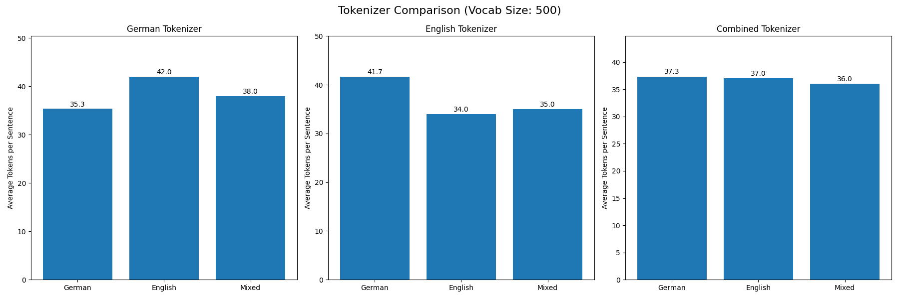
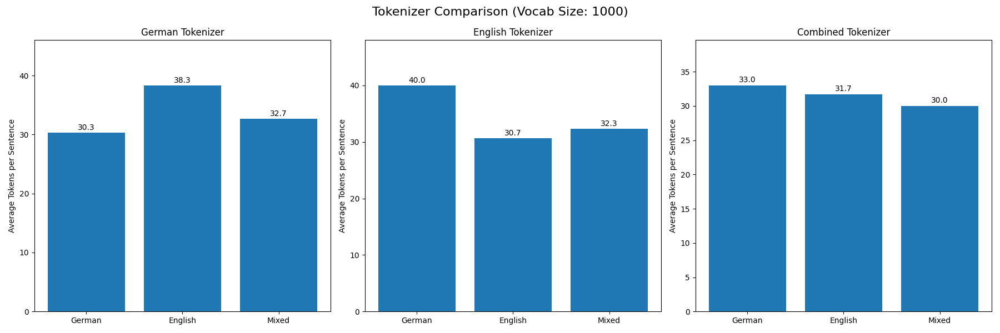
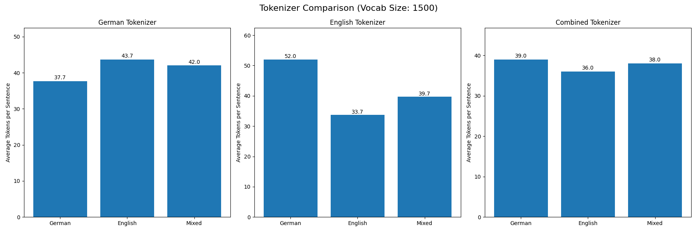

# Programmieraufgaben - Seminar zu Generativer KI 
Konrad Christoph Martens; Finnian

## 01 - BPE-Tokenizer
### b)
**Vokabulargröße: 500**

- Deutscher Tokenizer: Benötigt 48,3 Tokens pro Satz für deutschen Text, 53,0 für englischen Text und 48,3 für gemischten Text
- Englischer Tokenizer: Benötigt 55,7 Tokens pro Satz für deutschen Text, 43,3 für englischen Text und 45,7 für gemischten Text
- Kombinierter Tokenizer: Benötigt 51,0 Tokens pro Satz für deutschen Text, 46,0 für englischen Text und 45,3 für gemischten Text

**Vokabulargröße: 1000**

- Deutscher Tokenizer: Benötigt 40,3 Tokens pro Satz für deutschen Text, 47,0 für englischen Text und 46,0 für gemischten Text
- Englischer Tokenizer: Benötigt 53,7 Tokens pro Satz für deutschen Text, 37,7 für englischen Text und 42,7 für gemischten Text
- Kombinierter Tokenizer: Benötigt 43,3 Tokens pro Satz für deutschen Text, 39,7 für englischen Text und 41,3 für gemischten Text

**Vokabulargröße: 1500**

- Deutscher Tokenizer: Benötigt 37,7 Tokens pro Satz für deutschen Text, 43,7 für englischen Text und 42,0 für gemischten Text
- Englischer Tokenizer: Benötigt 52,0 Tokens pro Satz für deutschen Text, 33,7 für englischen Text und 39,7 für gemischten Text
- Kombinierter Tokenizer: Benötigt 39,0 Tokens pro Satz für deutschen Text, 36,0 für englischen Text und 38,0 für gemischten Text

Im Kontext des BPE-Algorithmus (Byte-Pair Encoding) sind diese Ergebnisse besonders aufschlussreich. Der BPE-Algorithmus funktioniert, indem er häufig vorkommende Zeichenpaare iterativ zusammenfügt, um ein Subword-Vokabular zu erstellen. Die Diagramme zeigen, dass die Tokenizer, die auf spezifischen Sprachen trainiert wurden, die statistischen Muster dieser Sprachen effektiv lernen konnten.
Die Effizienzunterschiede zwischen den Tokenizern spiegeln die sprachspezifischen Eigenschaften wider. Der deutsche Tokenizer hat beispielsweise gelernt, deutsche Komposita und morphologische Strukturen effizient zu kodieren, während der englische Tokenizer die häufigen englischen Wortbausteine besser repräsentiert. Die Ergebnisse zeigen auch, dass eine größere Vokabulargröße zu einer kompakteren Darstellung von Informationen führt, da mehr bedeutungsvolle Subword-Einheiten in einem einzelnen Token erfasst werden können.

Vocabulary size determines how many unique tokens will be in the tokenizer's vocabulary
Lower value (e.g., 100-500): Results in more and shorter tokens, higher compression ratio
Higher value (e.g., 1000+): Results in fewer and longer tokens, lower compression ratio
Trade-off: Small vocab = faster training but potentially less efficient encoding
Large vocab = slower training but potentially more efficient encoding

### c)
1. Sprachspezifische Effizienz: Jeder Tokenizer zeigt die beste Leistung in seiner eigenen Sprache. Der englische Tokenizer benötigt beispielsweise durchgängig weniger Tokens für englischen Text im Vergleich zu deutschem Text und umgekehrt.

2. Einfluss der Vokabulargröße: Mit zunehmender Vokabulargröße von 500 auf 1500 nimmt die Anzahl der benötigten Tokens pro Satz bei allen Tokenizern und Sprachkombinationen ab. Dies zeigt, wie größere Vokabulare eine effizientere Kodierung ermöglichen, indem sie häufige Subword-Muster erfassen.

3. Sprachübergreifende Leistung: Der deutsche Tokenizer zeigt schwächere Leistung bei englischem Text und benötigt deutlich mehr Tokens als bei der Verarbeitung von deutschem Text. Ähnlich verhält es sich beim englischen Tokenizer für deutschen Text.

4. Vorteile des kombinierten Tokenizers: Der kombinierte Tokenizer zeigt eine ausgewogenere Leistung in beiden Sprachen, obwohl er nicht so effizient ist wie sprachspezifische Tokenizer in ihrer jeweiligen Sprache. Er ist jedoch besser als einzelsprachige Tokenizer bei nicht-nativen Sprachen.

5. Abnehmender Grenznutzen: Die Effizienzgewinne durch die Erhöhung der Vokabulargröße zeigen einen abnehmenden Grenznutzen. Die Reduzierung der Tokens pro Satz beim Übergang von 1000 auf 1500 Vokabulargröße ist weniger dramatisch als von 500 auf 1000.

Die effizienteste Informationsrepräsentation hängt vom Anwendungsfall ab:

- Für einsprachige Anwendungen bieten sprachspezifische Tokenizer mit größeren Vokabularen die effizienteste Kodierung

- Für mehrsprachige Anwendungen bietet ein kombinierter Tokenizer den besten Kompromiss, mit angemessener Effizienz über verschiedene Sprachen hinweg ohne extreme Ineffizienz in einer bestimmten Sprache